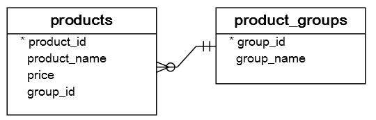
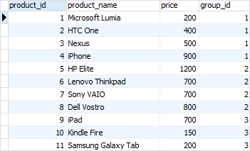
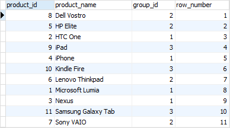
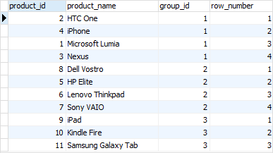
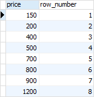
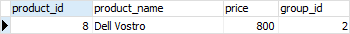

## ROW_NUMBER() function ( a window function )

[REF](https://www.postgresqltutorial.com/postgresql-window-function/postgresql-row_number/)

### init database

```sql
CREATE TABLE product_groups (
	group_id serial PRIMARY KEY,
	group_name VARCHAR (255) NOT NULL
);

CREATE TABLE products (
	product_id serial PRIMARY KEY,
	product_name VARCHAR (255) NOT NULL,
	price DECIMAL (11, 2),
	group_id INT NOT NULL,
	FOREIGN KEY (group_id) REFERENCES product_groups (group_id)
);

INSERT INTO product_groups (group_name)
VALUES
	('Smartphone'),
	('Laptop'),
	('Tablet');

INSERT INTO products (product_name, group_id,price)
VALUES
	('Microsoft Lumia', 1, 200),
	('HTC One', 1, 400),
	('Nexus', 1, 500),
	('iPhone', 1, 900),
	('HP Elite', 2, 1200),
	('Lenovo Thinkpad', 2, 700),
	('Sony VAIO', 2, 700),
	('Dell Vostro', 2, 800),
	('iPad', 3, 700),
	('Kindle Fire', 3, 150),
	('Samsung Galaxy Tab', 3, 200);
```

  


### simple

```sql
SELECT
	product_id,
	product_name,
	group_id,
	ROW_NUMBER () OVER (
           ORDER BY product_name
        )
FROM
	products;
```



### use PARTITION BY

```sql
SELECT
	product_id,
	product_name,
	group_id,
	ROW_NUMBER () OVER (
		PARTITION BY group_id
		ORDER BY
			product_name
	)
FROM
	products;
```



### get DISTINCT price

```sql
WITH prices AS (
	SELECT DISTINCT
		price
	FROM
		products
) SELECT
	price,
	ROW_NUMBER () OVER (ORDER BY price)
FROM
	prices;
```

or

```sql
SELECT
	price,
	ROW_NUMBER () OVER (ORDER BY price)
FROM
	(
		SELECT DISTINCT
			price
		FROM
			products
	) prices;
```



### for pagination

```sql
SELECT
	*
FROM
	(
		SELECT
			product_id,
			product_name,
			price,
			ROW_NUMBER () OVER (ORDER BY product_name)
		FROM
			products
	) x
WHERE
	ROW_NUMBER BETWEEN 6 AND 10;
```


### getting the nth highest / lowest row

```sql
SELECT
	*
FROM
	products
WHERE
	price = (
		SELECT
			price
		FROM
			(
				SELECT
					price,
					ROW_NUMBER () OVER (
						ORDER BY price DESC
					) nth
				FROM
					(
						SELECT DISTINCT
							(price)
						FROM
							products
					) prices
			) sorted_prices
		WHERE
			nth = 3
	);
```


