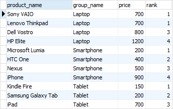
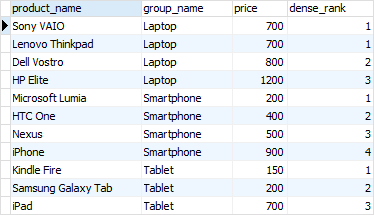
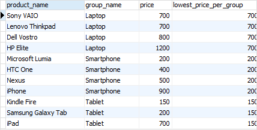
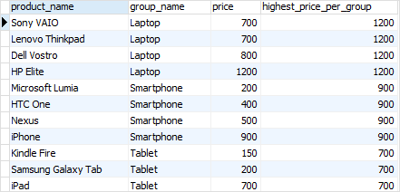
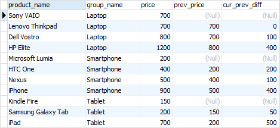
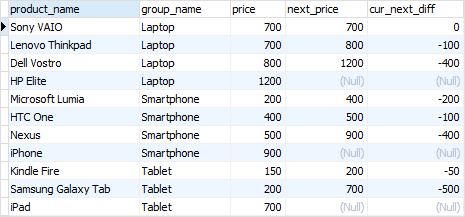

## window function

[REF](https://www.postgresqltutorial.com/postgresql-window-function/)

### init database

[REF](./row_number.md)

### syntax

```sql
window_function(arg1, arg2,..) OVER (
  [PARTITION BY partition_expression]
  [ORDER BY sort_expression [ASC | DESC] [NULLS {FIRST | LAST }])
```

### WINDOW

```sql
SELECT
  wf1() OVER(PARTITION BY c1 ORDER BY c2),
  wf2() OVER(PARTITION BY c1 ORDER BY c2)
FROM table_name;
```

as equal

```sql
SELECT
  wf1() OVER w,
  wf2() OVER w,
FROM table_name
WINDOW w AS (PARTITION BY c1 ORDER BY c2);
```

### avg

```sql
SELECT
  product_name,
  price,
  group_name,
  AVG (price) OVER (
    PARTITION BY group_name
  )
FROM
  products
  INNER JOIN
    product_groups USING (group_id);
```

### RANK

function assigns ranking within an ordered partition. If rows have the same values,
If rows have the same values, the RANK() function assigns the same rank, with the next ranking(s) skipped.

```sql
SELECT
  product_name,
  group_name,
  price,
  RANK () OVER (
    PARTITION BY group_name
    ORDER BY
      price
  )
FROM
  products
INNER JOIN product_groups USING (group_id);
```



### DENSE_RANK

the same ranks are assigned to multiple rows and no ranks are skipped

```sql
SELECT
  product_name,
  group_name,against
  price,
  DENSE_RANK () OVER (
    PARTITION BY group_name
    ORDER BY
      price
  )
FROM
  products
INNER JOIN product_groups USING (group_id);
```



### FIRST_VALUE and LAST_VALUE functions

The FIRST_VALUE() function returns a value evaluated against the first row within its partition, whereas the LAST_VALUE() function returns a value evaluated against the last row in its partition.

```sql
SELECT
  product_name,
  group_name,
  price,
  FIRST_VALUE (price) OVER (
    PARTITION BY group_name
    ORDER BY
      price
  ) AS lowest_price_per_group
FROM
  products
INNER JOIN product_groups USING (group_id);
```



```sql
SELECT
  product_name,
  group_name,
  price,
  LAST_VALUE (price) OVER (
    PARTITION BY group_name
    ORDER BY
      price RANGE BETWEEN UNBOUNDED PRECEDING
    AND UNBOUNDED FOLLOWING
  ) AS highest_price_per_group
FROM
  products
INNER JOIN product_groups USING (group_id);
```



**Notice** that we added the frame clause RANGE BETWEEN UNBOUNDED PRECEDING AND UNBOUNDED FOLLOWING because by default the frame clause is RANGE BETWEEN UNBOUNDED PRECEDING AND CURRENT ROW

### LAG and LEAD functions

The LAG() function has the ability to access data from the previous row, while the LEAD() function can access data from the next row.

syntax:

```sql
LAG  (expression [,offset] [,default]) over_clause;
LEAD (expression [,offset] [,default]) over_clause;
```

```sql
SELECT
	product_name,
	group_name,
	price,
	LAG (price, 1) OVER (
		PARTITION BY group_name
		ORDER BY
			price
	) AS prev_price,
	price - LAG (price, 1) OVER (
		PARTITION BY group_name
		ORDER BY
			price
	) AS cur_prev_diff
FROM
	products
INNER JOIN product_groups USING (group_id);
```



```sql
SELECT
	product_name,
	group_name,
	price,
	LEAD (price, 1) OVER (
		PARTITION BY group_name
		ORDER BY
			price
	) AS next_price,
	price - LEAD (price, 1) OVER (
		PARTITION BY group_name
		ORDER BY
			price
	) AS cur_next_diff
FROM
	products
INNER JOIN product_groups USING (group_id);
```


