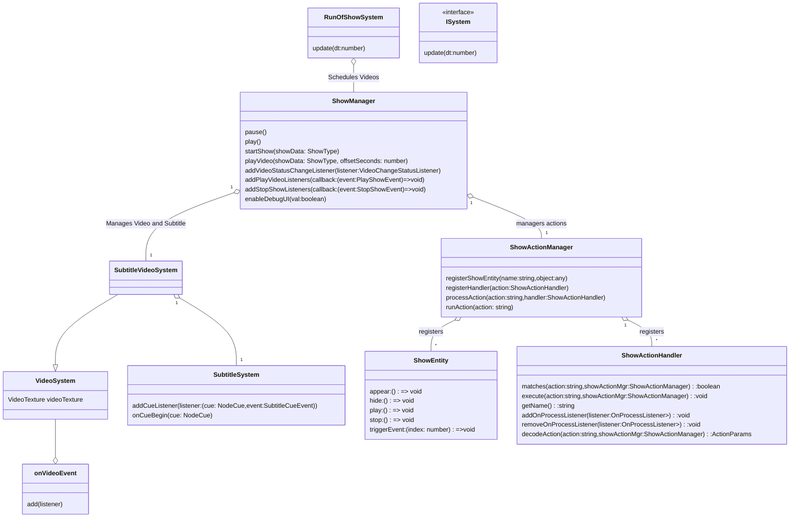

# classDiagram

[REF](https://github.com/mermaid-js/mermaid/blob/develop/docs/classDiagram.md)

```mermaid
classDiagram


ShowManager "1" o-- "1" SubtitleVideoSystem : Manages Video and Subtitle
SubtitleVideoSystem --|> VideoSystem
SubtitleVideoSystem "1" o-- "1" SubtitleSystem
VideoSystem : VideoTexture videoTexture
VideoSystem --o onVideoEvent

ShowManager "1" o--  "1" ShowActionManager : managers actions
ShowActionManager "1" o--  "*" ShowEntity : registers
ShowActionManager "1" o--  "*" ShowActionHandler : registers

RunOfShowSystem o-- ShowManager : Schedules Videos

class ISystem{
    <<interface>>
    update(dt:number)
}
class onVideoEvent{
    add(listener)
}
class RunOfShowSystem{
    update(dt:number)
}
class ShowActionManager{
    registerShowEntity(name:string,object:any)
    registerHandler(action:ShowActionHandler<any>)
    processAction(action:string,handler:ShowActionHandler<any>)
    runAction(action: string)
}

class ShowEntity{
  appear:() => void
  hide:() => void
  play:() => void
  stop:() => void
  triggerEvent: (index: number)=>void
}

class ShowActionHandler{
  matches(action:string,showActionMgr:ShowActionManager):boolean
  execute(action:string,showActionMgr:ShowActionManager):void
  getName():string
  addOnProcessListener(listener:OnProcessListener<ActionParams<T>>):void
  removeOnProcessListener(listener:OnProcessListener<ActionParams<T>>):void
  decodeAction(action:string,showActionMgr:ShowActionManager):ActionParams<T>
}
class ShowManager{
    pause()
    play()
    startShow(showData: ShowType)
    playVideo(showData: ShowType, offsetSeconds: number)
    addVideoStatusChangeListener(listener:VideoChangeStatusListener)
    addPlayVideoListeners(callback:(event:PlayShowEvent)=>void)
    addStopShowListeners(callback:(event:StopShowEvent)=>void)
    enableDebugUI(val:boolean)
}
class SubtitleSystem{
    addCueListener(listener:(cue: NodeCue,event:SubtitleCueEvent))
    onCueBegin(cue: NodeCue)
}
```
