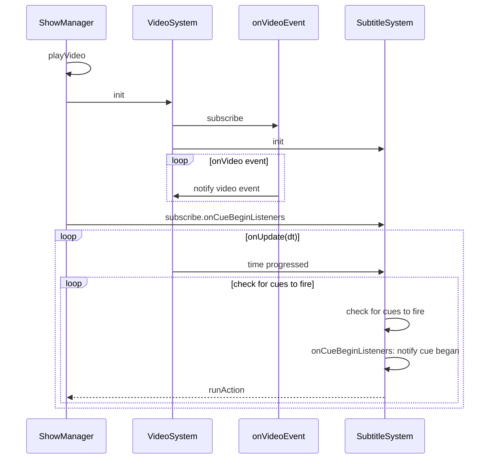

# sequenceDiagram

REF

- [https://github.com/mermaid-js/mermaid/blob/develop/docs/sequenceDiagram.md](https://github.com/mermaid-js/mermaid/blob/develop/docs/sequenceDiagram.md)
- [https://sequencediagram.org/instructions.html](https://sequencediagram.org/instructions.html)

